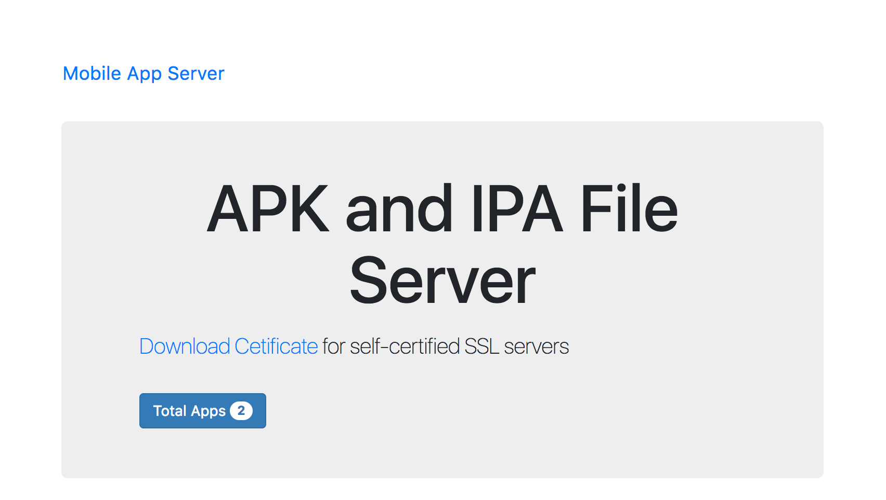
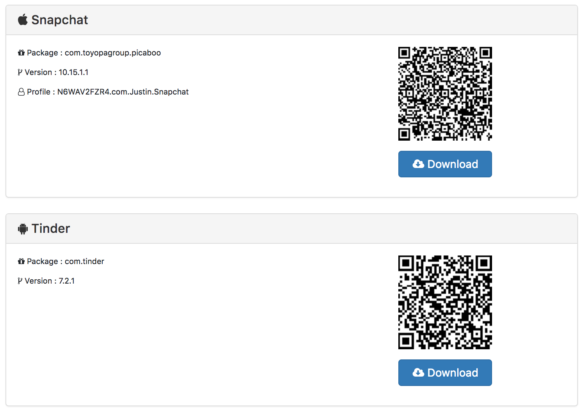

# Mobile App Server



## Example



## Purpose
 
 > Serve Android and Apple applications to Mobile Devices.

### Requires

* Node.js
* SSL Cert

### Platforms

* MAC OS
* Windows
* Linux

### Main Features

1. Automatically discovers new Apps on page refresh, simply add files to path.

2. Designed for Local Intranet usage, but could be deployed to cloud.

3. Provides package information and QR Code per app.

4. Secured on HTTPS - Requires an SSL certificate (Self Cert or Full).


### Pre-requisite

SSL Certificate. A self-cert can be generated manually or generated online. 

An example website is http://www.selfsignedcertificate.com/ 

Simply enter your local IP addres, and download the files. 

Name the files `server.crt` and `server.key`.

Place them in a folder and specify the folder path as part of the usage.

### Installation

```

$ npm install mobile-app-server -g

```

### Usage

```

  Usage: mobile-app-server [files] [ssl]


  Options:

    -V, --version        output the version number
    -p, --port [value]   port
    -f, --files <files>  path to ipa/apk files
    -s, --ssl <ssl>      path to SSL .key and .crt
    -h, --help           output usage information

```

e.g.

```

node mobile-app-server -f /to/files/path/ -s /to/certs/path -p 8080

```

-s : Path to SSL `server.crt` and `server.key` files. 

-f : Path to APK and/or IPA files

-p : Optional PORT number (Default is 3001)


### Future Roadmap

1. Drag and Drop app addition via Web Interface.

2. App Icons.

3. Extended package information.
